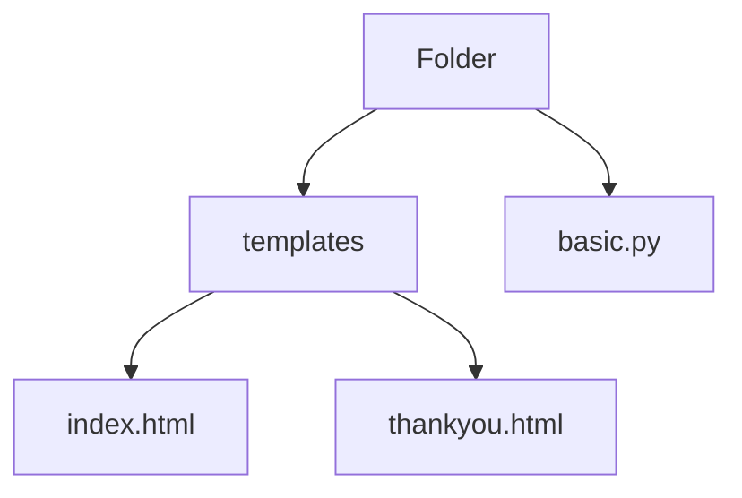

```python
# basic.py
from flask import Flask, render_template, session, redirect, url_for
from flask_wtf import FlaskForm
from wtforms import (StringField, BooleanField, DateTimeField, RadioField, 
                        SelectField, TextField, TextAreaField, SubmitField)

from wtforms.validators import DataRequired

app = Flask(__name__)

app.config['SECRET_KEY'] = 'mysecretkey'

# normally this would go in a separate .py file
class InfoForm(FlaskForm):
    breed = StringField("What breed are you?", validators=[DataRequired()])
    neutered = BooleanField("Have you been neutered?")
    mood = RadioField('Please choose your mood:', 
                        choices=[('mood_one', 'Happy'), ('mood_two', 'Excited')])
    food_choice = SelectField(u'Pick your favorite food:',
                                choices=[('chi', 'Chicken'), ('bf', 'Beef'), ('fish', 'Fish')])
    feedback = TextAreaField()
    submit = SubmitField('Submit')


@app.route('/', methods=['GET', 'POST'])
def index():
    breed = False

    form = InfoForm()
    if form.validate_on_submit():
        session['breed'] = form.breed.data
        session['neutered'] = form.neutered.data
        session['mood'] = form.mood.data
        session['food'] = form.food_choice.data
        session['feedback'] = form.feedback.data
    
        return redirect(url_for('thankyou'))
    
    return render_template('index.html', form=form)


@app.route('/thankyou')
def thankyou ():
    return render_template('thankyou.html')


if __name__ == '__main__':
  app.run(host='127.0.0.1', port=8000, debug=True)
```

```html
<!-- index.html -->
<h1>Welcome to the Puppy Survey</h1>

<form method="POST">
    {{ form.hidden_tag()}}
    {{ form.breed.label}} {{form.breed}}
	<br>
	{{ form.neutered.label }}{{ form.neutered }}
	<br>
	{{ form.food_choice.label }} {{ form.food_choice }}
	<br>
	{{ form.mood.lable }} {{ form.mood }}
	<br>
	Any other feedback?
	<br>
	{{ form.feedback }}
	<br>
    {{ form.submit() }}
</form>
```

```html
<!-- thankyou.html -->
<h1>Thank you. Here is the info you gave us: </h1>
<ul>
    <li>Breed: {{ session['breed'] }}</li>
    <li>{{ session['neutered'] }}</li>
    <li>Mood: {{ session['mood'] }}</li>
    <li>Food: {{ session['food'] }}</li>
    <li>Feedback: {{ session['feedback'] }}</li>
</ul>
```